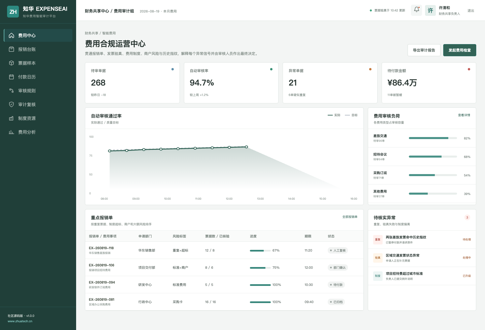
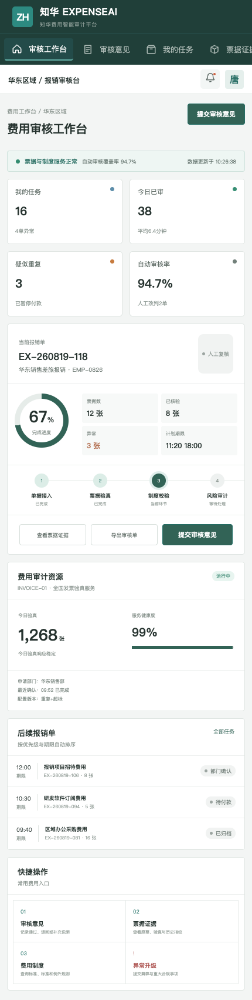

# Zhuatech ExpenseAI

费用合规不是简单的“金额是否超标”。ExpenseAI 社区版把票据验真、重复指纹、费用制度、商户风险、消费时间和大额门槛放在同一条可解释审核链路中。

**维护单位：** [知华科技｜上海如静知华信息科技有限公司](https://www.zhuatech.cn/)　**包名：** `cn.zhuatech.expenseai`



## 适用场景

- 财务共享中心自动审核与人工复核分流；
- 差旅、招待、采购订阅和项目费用制度校验；
- 发票验真、重复报销识别和付款前阻断；
- 部门例外审批、大额双人复核和审计证据留存；
- 与 OA、ERP、财务和银企付款系统集成。

系统输出 `PASS / MANUAL_REVIEW / BLOCK`，同时返回风险分数、命中原因和是否需要审核员复核，不进行无人值守付款。



## 本地部署

Java 21 + Spring Boot + Spring Security/JWT + JPA/Flyway + MySQL 8；Vue 3 + Vite + Pinia。

```bash
docker compose up --build
```

前端：`http://localhost:5173`；演示账号：`admin / Demo@2026`、`operator / Demo@2026`。核心接口为 `POST /api/ai/expense/audit`，详细内容见 [docs/api.md](docs/api.md)。

## 非商业使用许可

本工程仅限个人非商业学习和技术交流，**不得商用**。企业内部使用、生产部署、SaaS、实施交付、收费服务、品牌替换与商业再发行须获得上海如静知华信息科技有限公司书面授权，详见 [LICENSE](LICENSE)。

费用管理、财务共享、AI 私有化、ERP/OA 集成、软件外包或定制实施，请访问[知华科技官网](https://www.zhuatech.cn/)并扫码联系：

| 微信一 | 微信二 |
| --- | --- |
|  |  |

Copyright © 2026 上海如静知华信息科技有限公司
